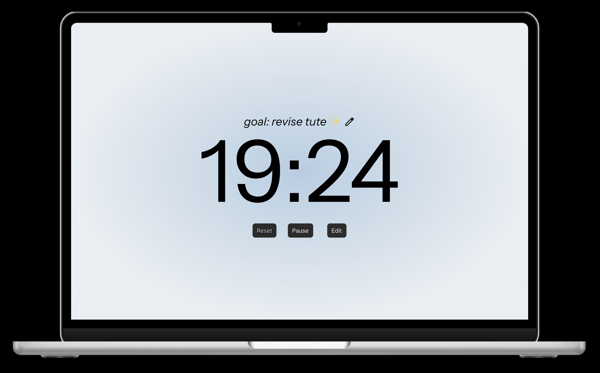
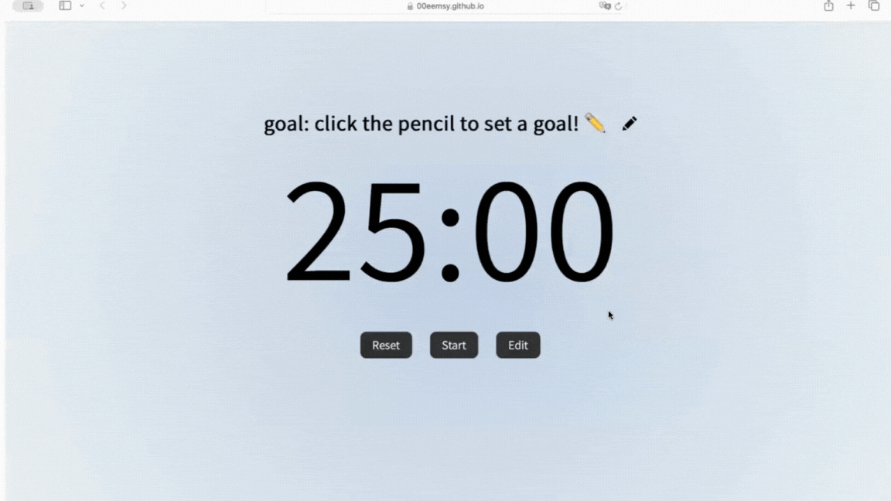
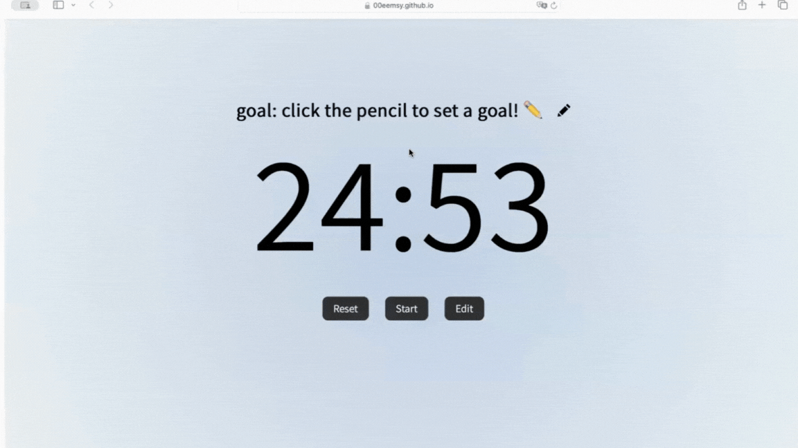
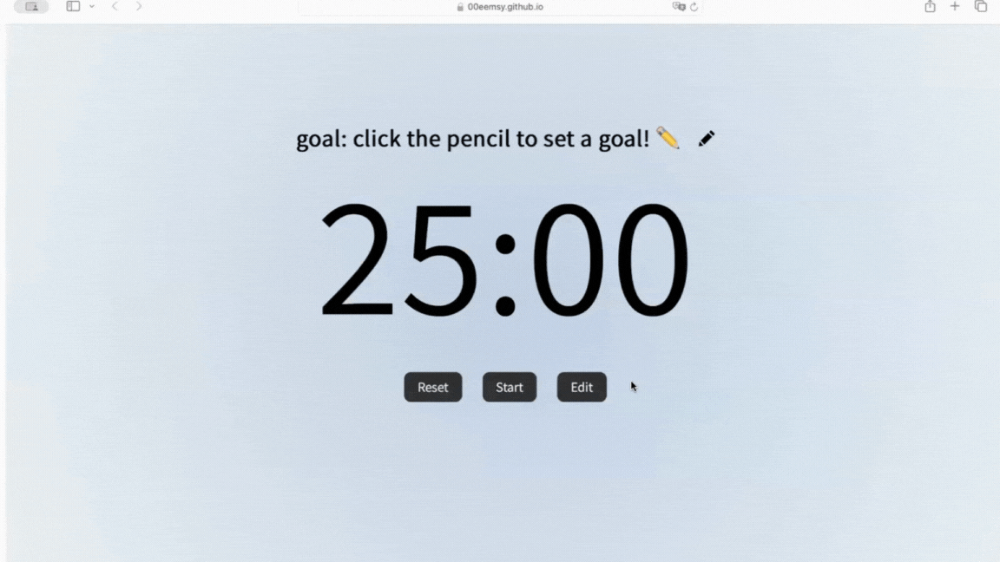
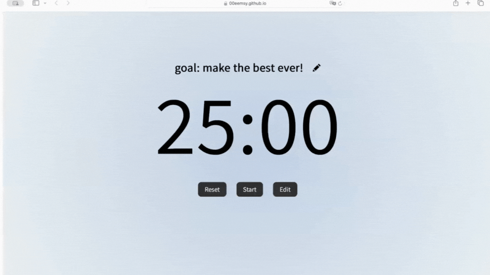

## 👩🏻‍💻 DESCRIPTION

Welcome to `study_timer ⏲️`, my take on a clean and visually-appealing study timer. `study_timer ⏲️` was born out of my desire for a beautiful study timer that actually worked. Something not too frilly, but customizable enough to make every study session a bit more fun!

This web app is React.js-based with CSS for stylizations. I also employ the [**Reactjs-popup**](https://github.com/yjose/reactjs-popup) library for popup functionality, with an SVG from [**iconmonstr**](https://iconmonstr.com/pencil-14-svg/ ) and an audio from [**freesound_community**](https://pixabay.com/users/freesound_community-46691455/?utm_source=link-attribution&utm_medium=referral&utm_campaign=music&utm_content=14575) from [**Pixabay**](https://pixabay.com//?utm_source=link-attribution&utm_medium=referral&utm_campaign=music&utm_content=14575).

Additionally, I employed Figma to map out the UI/UX. You can find the original design linked [**here**](https://www.figma.com/proto/lyvhaH97QPDDCc10jmCqUd/timer-app?node-id=1-2&p=f&t=lu26ndfDqhU7Mrmh-1&scaling=scale-down&content-scaling=fixed&page-id=0%3A1&starting-point-node-id=1%3A2).

⬇️ Prototype sample of `study_timer ⏲️` from Figma:


⬇️ Opening still of `study_timer ⏲️`:


## 💡 INSTRUCTIONS
* Set how long you want the timer to run for with the `Edit` button
* Set a goal for your study session with the pencil button
* Begin your study session with `Start`
    * Stop a session with `Pause`
    * Start from the top with `Reset`

## 📦 INSTALLING AND RUNNING
1. Open via [**GitHub pages link**](https://00eemsy.github.io/study_timer/)

Or

1. From [**00eemsy/study_timer**](https://github.com/00eemsy/study_timer), download all of the files with the `<> CODE` button. These files include:
    * the `public` folder
    * and the `src` folder, which includes:
        * the `fonts` folder, which power the typography for the site
        * the `timer` folder, which provides the main body of code for the site
        * ... and more!
    * ... and more!
2. Using your preferred console, type the following:
```
npm run start
```
3. If not already automatically prompted, open the following link on your preferred browser: [**https://localhost:3000**](https://localhost:3000)

## 🎮 DEMOS

_Starting/pausing the timer_


_Resetting the timer_


_Editing how long the timer is_


_Setting a goal for the study session_
